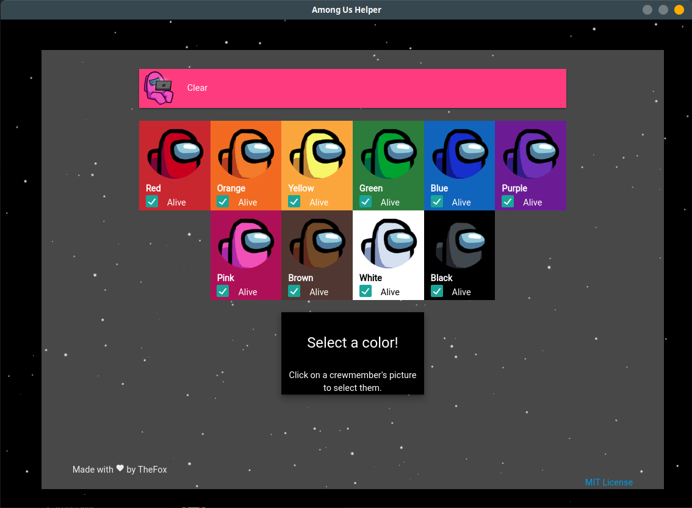
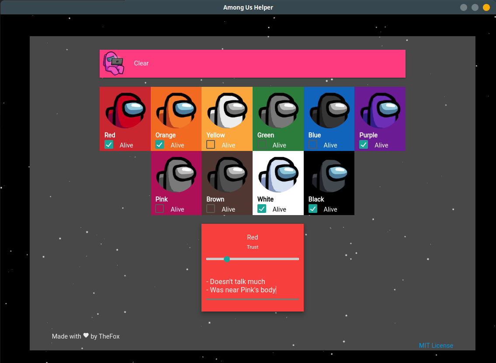
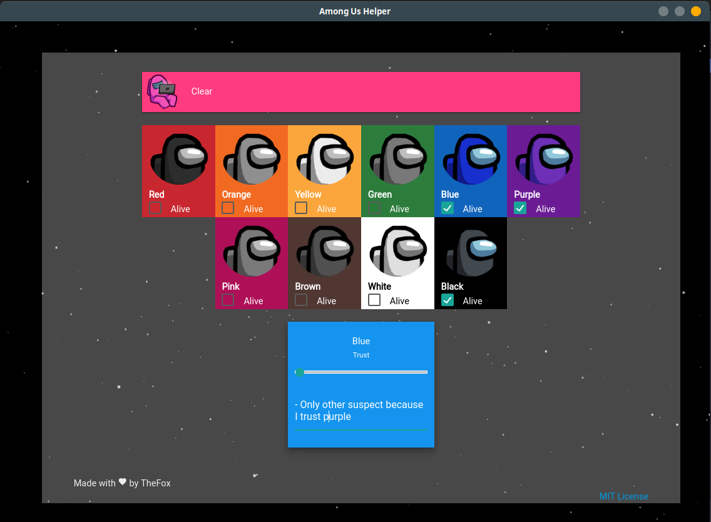

# Among Us Helper
small little helper for among us games

you can try it out [here](https://thefoxbot.github.io/amongus-helper/)

## Install (Electron)
clone the repo to a folder
```
git clone https://github.com/thefoxbot/amongus-helper.git
```

install all the required dependencies
```
npm install
```

run it
```
npm start
```

## Screenshots





